<h1>Compte rendu du projet e_banking (Backend)</h1>

<h3>Présentation du projet Digital Banking</h3>

Ce projet consiste à concevoir une application de e_banking pour digitaliser  
les processus des banques, la création des comptes et les différentes opérations
effectuées sur un compte bancaire.  Ce projet a été réalisé en se basant sur 
l'architecture JEE avec Spring pour le backend avec spring security pour la partie sécurité  et Angular pour le frontend.

<h3>Compte rendu du Backend</h3>
<h4>Diagramme de classe</h4>
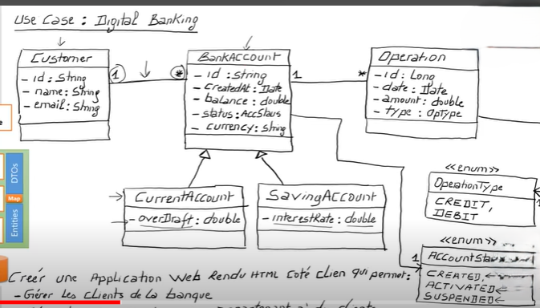

<h4>Single table</h4>

Afin de représenter l'héritage dans le modèle relationnel j'ai utilisé l'approche
"Single table" qui consiste à créer une table dans la base de données qui va rassembler 
les attributs de la classe abstraite ainsi que les attributs des classes qui héritent de la classe abstraite
tout en ajoutant un attribut type pour différencier les comptes épargnes des compte courants.

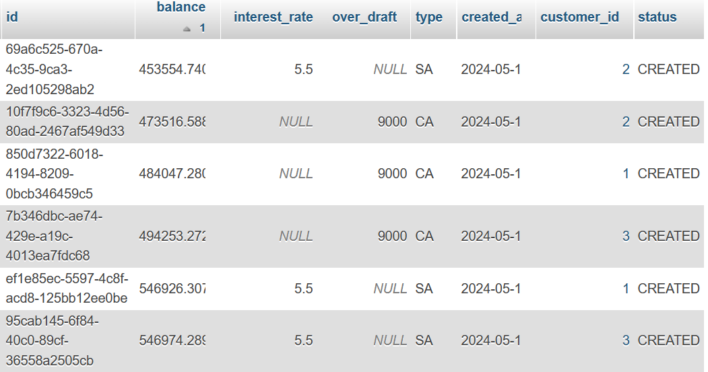

<h4>Opération du compte</h4>

Pour chaque compte j'ai créé un ensemble d'operations de débit et de crédit

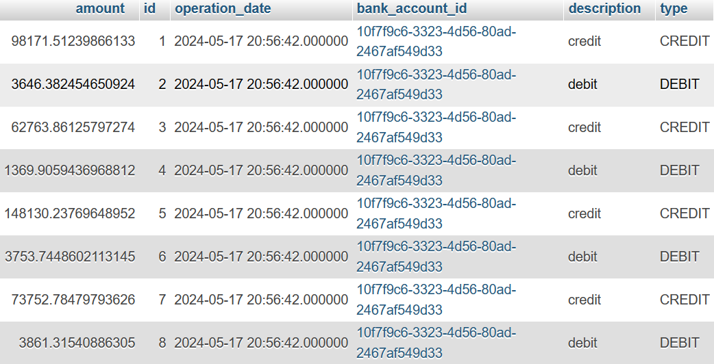

<h4>Fonctionnalités:</h4>

En ce qui concerne les actions j'ai créé deux controlleurs un qui gère
les actions du customer et le deuxieme qui gère les actions du compte bancaire
ils font tous les deux appel à la couche service et au DTOs

<h4>Test des actions:</h4>

Pour tester les actions de mes controlleurs j'ai utilisé Postman 

<h4>Test des actions (Customer):</h4>
<h5>liste des customers :</h5>
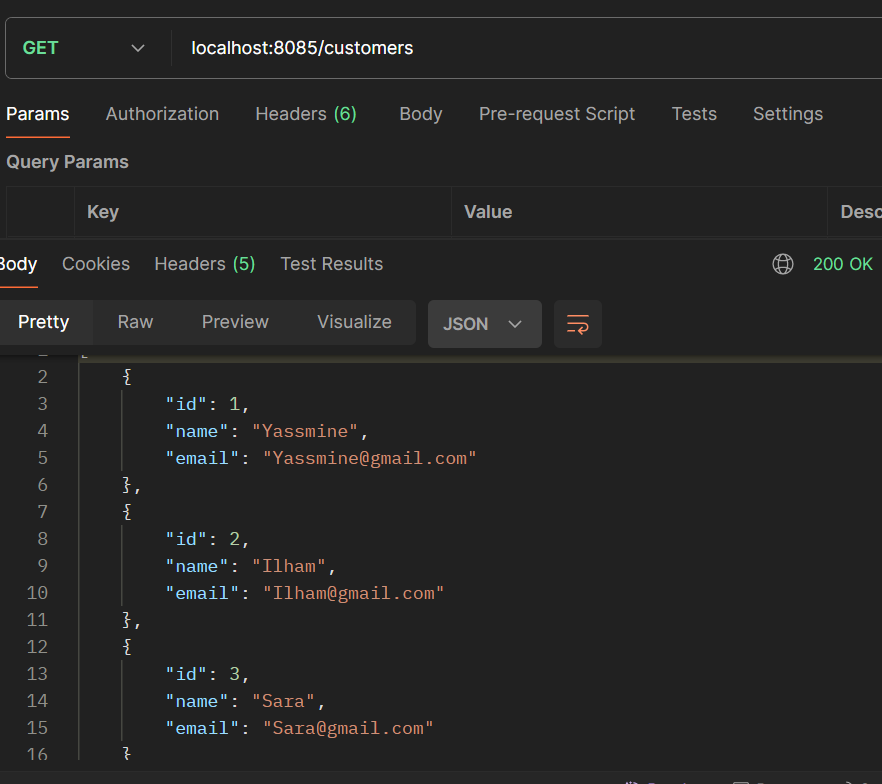

<h5>Get customer :</h5>
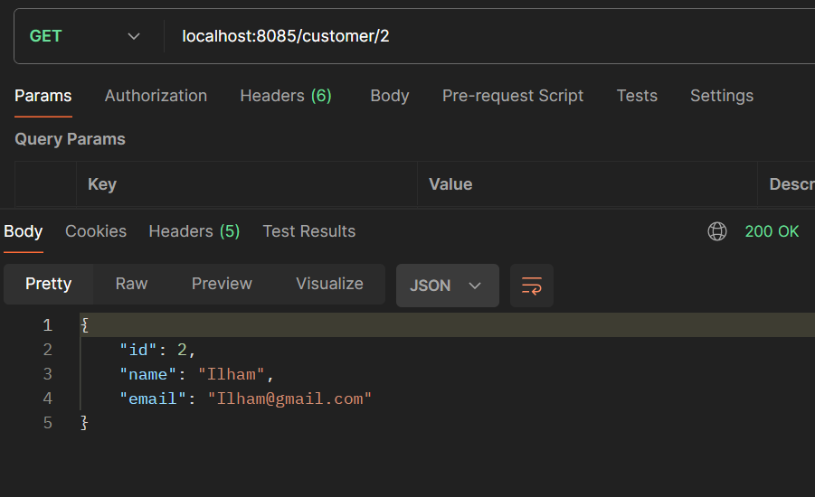

<h5>Add customer :</h5>
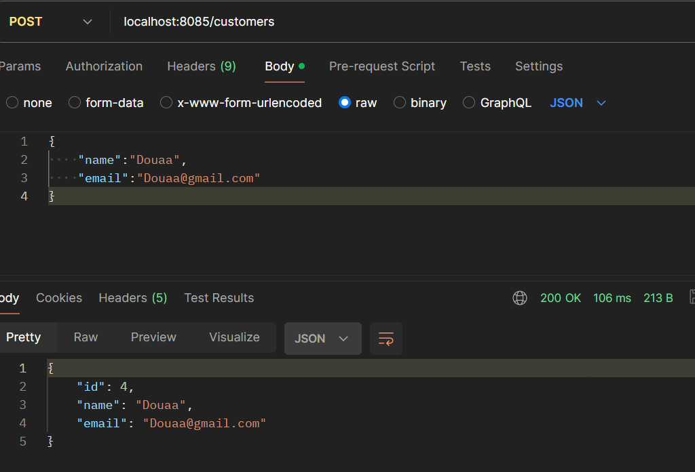

<h5>Update customer :</h5>

<h4>Test des actions (BankAccount):</h4>

<h5>liste des comptes :</h5>
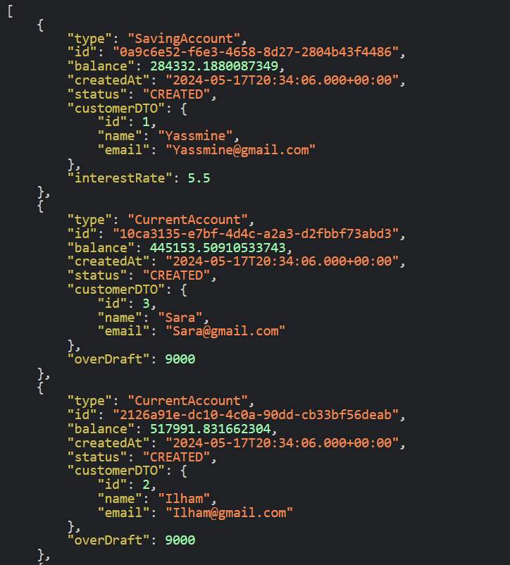

<h5>Get compte :</h5>
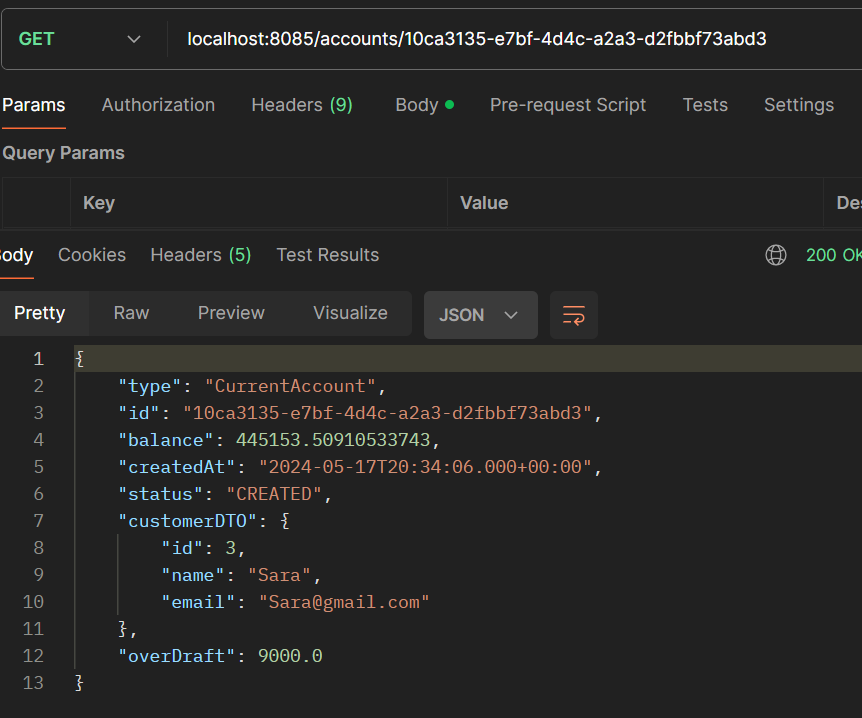

<h5>Get l'historique du compte :</h5>
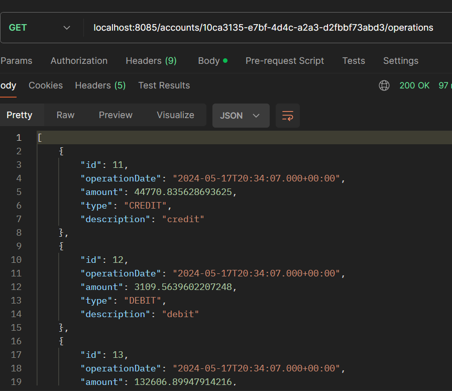

<h5>Get l'historique du compte avec la pagination :</h5>
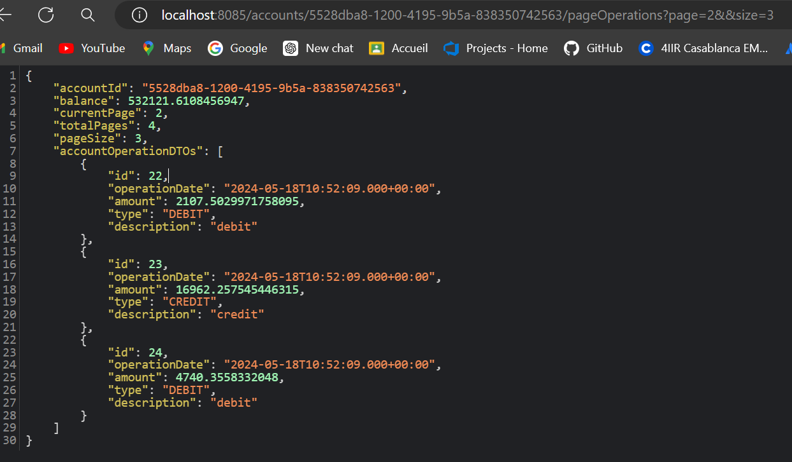

<h5>Operation de transfert :</h5>
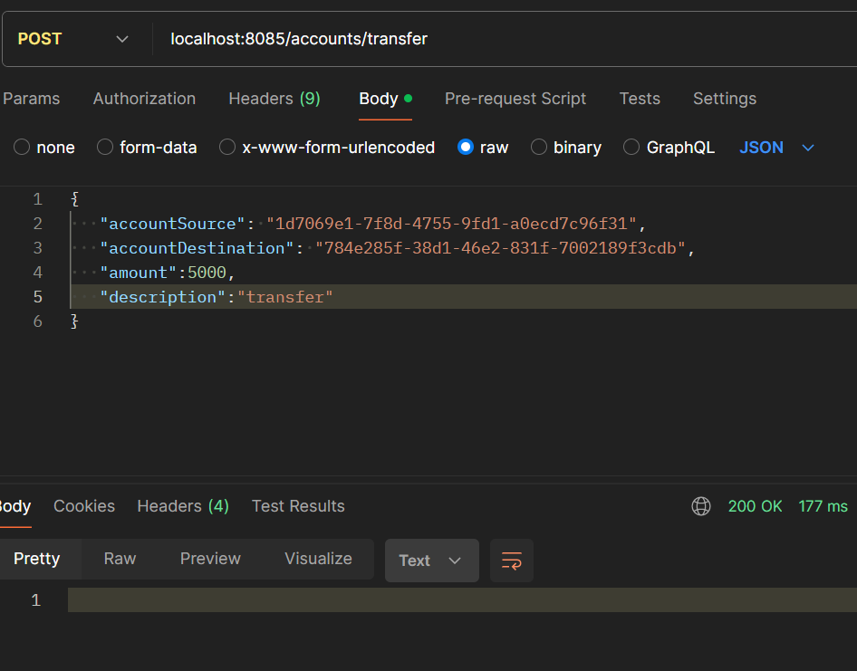

<h3>Partie sécurité avec spring security</h3>

Pour la partie sécurité coté backend, j'ai créé un package qui contient deux classes:

<ul>
<li>une classe de configuration: Elle gère les utilisateurs en mémoire et l'encodage des mots de passe.
Elle définit des filtres de sécurité pour les requêtes HTTP, y compris la configuration des serveurs de ressources OAuth2 pour JWT.
Elle gère les CORS pour permettre les requêtes de toutes les origines.
Elle configure un gestionnaire d'authentification basé sur les détails des utilisateurs et un encodeur de mots de passe.</li>
<li>une classe controlleur: Cette classe gère deux opérations principales :

Récupérer les détails d'authentification de l'utilisateur connecté (/auth/profile).
Authentifier un utilisateur et générer un token JWT (/auth/login).
Elle utilise AuthenticationManager pour authentifier les utilisateurs et JwtEncoder pour créer des tokens JWT contenant des informations sur l'utilisateur, 
telles que le nom d'utilisateur et les rôles.

</li>
</ul>

