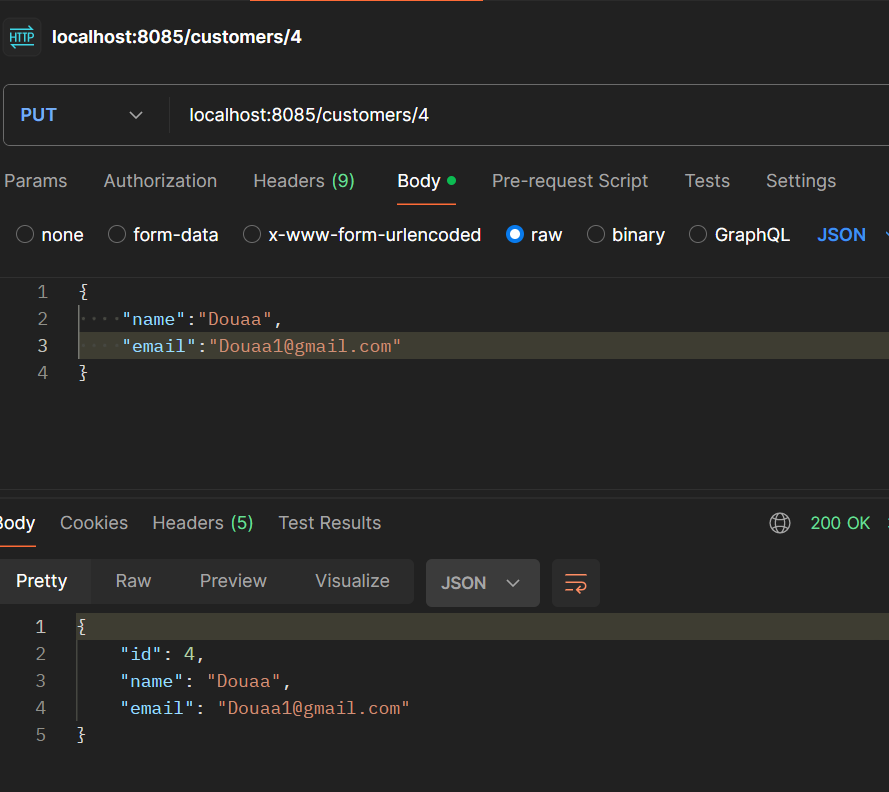

<h1>Compte rendu du projet e_banking (Backend)</h1>

<h3>Présentation du projet Digital Banking</h3>

Ce projet consiste à concevoir une application de e_banking pour digitaliser  
les processus des banques, la création des comptes et les différentes opérations
effectuées sur un compte bancaire.  Ce projet a été réalisé en se basant sur 
l'architecture JEE avec Spring pour le backend et Angular pour le frontend.

<h3>Compte rendu du Backend</h3>
<h4>Diagramme de classe</h4>

<h4>Single table</h4>

Afin de représenter l'héritage dans le modèle relationnel j'ai utilisé l'approche
"Single table" qui consiste à créer une table dans la base de données qui va rassembler 
les attributs de la classe abstraite ainsi que les attributs des classes qui héritent de la classe abstraite
tout en ajoutant un attribut type pour différencier les comptes épargnes des compte courants.

<h4>Opération du compte</h4>

Pour chaque compte j'ai créé un ensemble d'operations de débit et de crédit

<h4>Fonctionnalités:</h4>

En ce qui concerne les actions j'ai créé deux controlleurs un qui gère
les actions du customer et le deuxieme qui gère les actions du compte bancaire
ils font tous les deux appel à la couche service et au DTOs

<h4>Test des actions:</h4>

Pour tester les actions de mes controlleurs j'ai utilisé Postman 

<h4>Test des actions (Customer):</h4>
<h5>liste des customers :</h5>

<h5>Get customer :</h5>

<h5>Add customer :</h5>

<h5>Update customer :</h5>

<h4>Test des actions (BankAccount):</h4>

<h5>liste des comptes :</h5>

<h5>Get compte :</h5>

<h5>Get l'historique du compte :</h5>

<h5>Operation de transfert :</h5>

